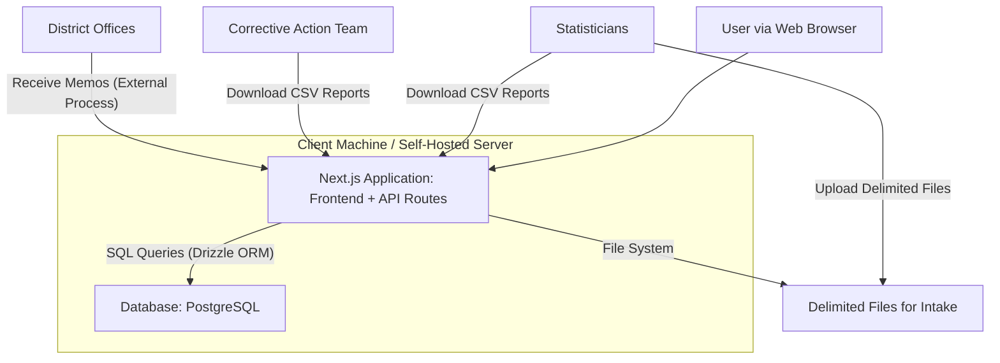

## Application Design Document: QC Client File Review CRM

**Version:** 1.0
**Date:** 5/7/2025
**Author:** T3 Chat (Prepared for Programmer)
**Status:** Draft

### 1. Introduction

This document outlines the design for a new Quality Control (QC) Client File Review Customer Relationship Management (CRM) application. The primary purpose of this system is to streamline the process of reviewing client files sampled monthly by the statistics department. It will facilitate work distribution to QC analysts, enable comprehensive documentation of case reviews, manage error identification and reporting, and support supervisor approval workflows. The system aims to be simple, lightweight, extensible, and self-hostable.

### 2. Goals and Objectives

*   **Streamline Workflow:** Efficiently manage the intake of client samples and distribution to analysts.
*   **Standardize Documentation:** Provide a consistent platform for analysts to document client data verifications, case history, notes, and identified errors.
*   **Improve Data Quality:** Implement data validation at the point of entry.
*   **Facilitate Oversight:** Enable supervisor review and approval of completed case reviews.
*   **Automate Error Communication:** Generate and track memos for errors to be sent to district offices and share data with the corrective action team.
*   **Support Reporting Needs:** Store data in a structured format conducive to reporting for the statistics department, monthly management updates, and annual C-suite presentations.
*   **Ensure Simplicity and Maintainability:** Develop a lightweight application that is easy to use and maintain.
*   **Enable Self-Hosting:** Design the application to be deployable on team computers without reliance on general server infrastructure, if necessary.
*   **Promote Extensibility:** Build a foundation that allows for future enhancements and feature additions.

### 3. Scope

#### 3.1. In-Scope Features (MVP - Minimum Viable Product)

*   **User Management:**
    *   User authentication (login/logout).
    *   Roles: Analyst, Supervisor, Administrator.
*   **Sample Intake:**
    *   Manual upload of delimited files (e.g., CSV, TSV) containing monthly client samples.
    *   Parsing and ingestion of client data from these files.
*   **Case Management:**
    *   Automatic creation of cases from ingested client samples.
    *   Assignment of cases to QC analysts (initially manual or round-robin by an admin/supervisor).
    *   Dashboard for analysts to view their assigned cases.
    *   Case status tracking (e.g., New, In Progress, Pending Supervisor Review, Approved, Rejected).
*   **Case Documentation (Analyst Workflow):**
    *   View client data.
    *   Input client data verifications.
    *   Log case history (manual entries).
    *   Add case-specific notes.
    *   Identify and document errors, including error type, description, and severity.
    *   Basic data validation on input fields (e.g., required fields, data types).
*   **Supervisor Review Workflow:**
    *   Dashboard for supervisors to view cases pending review.
    *   Ability to review all analyst documentation for a case.
    *   Approve or reject cases, with an option to provide feedback.
*   **Error Reporting Workflow:**
    *   Automated flagging of approved cases with errors for memo generation.
    *   Interface to select errors for inclusion in memos to specific district offices.
    *   Basic memo generation (content can be templated or manually entered initially).
    *   Mechanism to mark memos as sent.
    *   Data export/sharing mechanism for the corrective action team (e.g., CSV export of errors).
*   **Data Storage:**
    *   Relational database storage for all application data.
*   **Reporting Support:**
    *   Ability to export case data, error data, and client verification data in CSV format.
*   **Administration:**
    *   Basic user management interface.
    *   System configuration settings (e.g., district office list).

#### 3.2. Out-of-Scope Features (Future Considerations)

*   Advanced automated case assignment rules.
*   Direct integration with MS Access for statisticians (beyond file export).
*   In-app rich text editor for memos.
*   Automated email sending for memos.
*   Advanced analytics and visualization dashboards within the application.
*   Full audit trail for all data changes (beyond basic case history).
*   Direct API integrations with other internal systems.
*   Public-facing API for external access.

### 4. Target Users

*   **QC Analysts:** Primary users for documenting case reviews.
*   **QC Supervisors:** Review and approve analyst work, manage case assignments.
*   **Statisticians:** Provide input files and consume output data/reports.
*   **Corrective Action Team:** Receive information on identified errors.
*   **Management/C-Suite:** Receive summary reports.
*   **System Administrators:** Manage users and system configuration.

### 5. Functional Requirements

| ID   | Requirement                                                                 | User Role(s)                     | Priority |
| :--- | :-------------------------------------------------------------------------- | :------------------------------- | :------- |
| FR01 | System shall allow authenticated users to log in and log out.               | All                              | High     |
| FR02 | System shall support user roles: Analyst, Supervisor, Administrator.        | Admin                            | High     |
| FR03 | Admin shall be able to manage user accounts (create, edit, assign roles).   | Admin                            | High     |
| FR04 | System shall allow upload of delimited files (CSV/TSV) for client samples.  | Admin/Supervisor                 | High     |
| FR05 | System shall parse uploaded files and create new client records and cases.  | System                           | High     |
| FR06 | Cases shall be assignable to Analysts.                                      | Supervisor/Admin                 | High     |
| FR07 | Analysts shall see a list of their assigned cases.                          | Analyst                          | High     |
| FR08 | Analysts shall be able to view client data for an assigned case.            | Analyst                          | High     |
| FR09 | Analysts shall be able to document client data verifications.               | Analyst                          | High     |
| FR10 | Analysts shall be able to record case history entries.                      | Analyst                          | High     |
| FR11 | Analysts shall be able to add notes to a case.                              | Analyst                          | High     |
| FR12 | Analysts shall be able to identify and document errors found in a case.     | Analyst                          | High     |
| FR13 | System shall perform basic validation on data entry fields.                 | System                           | Medium   |
| FR14 | Analysts shall be able to submit a completed case for supervisor review.    | Analyst                          | High     |
| FR15 | Supervisors shall see a list of cases pending their review.                 | Supervisor                       | High     |
| FR16 | Supervisors shall be able to review all data documented by the analyst.     | Supervisor                       | High     |
| FR17 | Supervisors shall be able to approve or reject a reviewed case.             | Supervisor                       | High     |
| FR18 | If rejected, Supervisors shall be able to provide feedback to the analyst.  | Supervisor                       | Medium   |
| FR19 | System shall identify approved cases with errors for memo processing.       | System                           | High     |
| FR20 | Supervisors/Admins shall be able to generate memos for errors.              | Supervisor/Admin                 | High     |
| FR21 | Memos shall be directable to specific district offices.                     | Supervisor/Admin                 | High     |
| FR22 | System shall allow marking memos as "sent".                                 | Supervisor/Admin                 | Medium   |
| FR23 | System shall allow export of error data for the corrective action team.     | Supervisor/Admin                 | High     |
| FR24 | System shall allow export of case and client data for reporting (CSV).      | Admin/Supervisor/Statistician    | High     |
| FR25 | System shall store all relevant data in a relational database.              | System                           | High     |

### 6. Non-Functional Requirements

*   **NFR01 (Usability):** The application interface shall be intuitive and require minimal training for users familiar with web applications.
*   **NFR02 (Performance):** Page loads should be responsive, typically under 3 seconds for common operations. File uploads should be processed efficiently.
*   **NFR03 (Scalability):** The system should handle the current expected load of monthly samples and user activity, with consideration for moderate growth (e.g., 20-50% increase in users/data over 2 years).
*   **NFR04 (Reliability):** The system should be stable and available during working hours. Data integrity is critical.
*   **NFR05 (Security):**
    *   Secure user authentication and authorization.
    *   Protection against common web vulnerabilities (e.g., XSS, SQL Injection).
    *   Sensitive data should be handled appropriately.
*   **NFR06 (Maintainability):** Code should be well-structured, commented, and version-controlled. The chosen technology stack should support long-term maintenance.
*   **NFR07 (Deployability):** The application must be deployable on team computers (Windows/macOS/Linux) using a self-contained package (e.g., Docker containers). It should also be deployable to a standard server environment if approved.
*   **NFR08 (Extensibility):** The architecture should allow for the addition of new features and modules with reasonable effort.
*   **NFR09 (Lightweight):** The application should not require excessive system resources to run, both on the server/host and client-side.

### 7. System Architecture

A simplified two-tier architecture using Next.js as a full-stack framework:

1.  **Application Tier:** Next.js application combining both frontend React components and backend API routes in a single framework.
2.  **Data Tier:** A PostgreSQL database for persistent storage.

**Data Flow for Sample Intake:**

1.  Admin/Supervisor uploads a delimited file via the Next.js frontend.
2.  Frontend sends the file to Next.js API routes.
3.  API route parses the file, validates basic structure.
4.  API route creates `Client` records and associated `Case` records in the PostgreSQL database.
5.  Cases are initially unassigned or assigned based on a simple default rule.

**Data Flow for Case Review:**

1.  Analyst logs in, views assigned cases.
2.  Analyst selects a case, views client data.
3.  Analyst inputs verifications, notes, history, and errors via forms in the Next.js frontend.
4.  Frontend sends data to Next.js API route endpoints.
5.  API routes validate data and save it to the database, updating case status.
6.  Analyst submits case for review.
7.  Supervisor views pending cases, reviews data, approves/rejects via frontend.
8.  API routes update case status and log supervisor actions.

### 8. Data Model (High-Level)

Key entities:

*   **`User`**: Stores user credentials and roles.
    *   `id` (PK), `username`, `passwordHash`, `role` (ENUM: ANALYST, SUPERVISOR, ADMIN), `createdAt`, `updatedAt`
*   **`ClientSampleBatch`**: Represents an uploaded batch of client samples.
    *   `id` (PK), `fileName`, `uploadedAt`, `uploadedByUserId` (FK to User), `processedAt`, `rowCount`
*   **`Client`**: Stores information about an individual client from a sample.
    *   `id` (PK), `clientSampleBatchId` (FK to ClientSampleBatch), `clientIdentifier` (e.g., account number), `clientDataJSON` (flexible JSONB for various client fields), `createdAt`, `updatedAt`
*   **`Case`**: Represents a review task for a client.
    *   `id` (PK), `clientId` (FK to Client, UNIQUE), `assignedAnalystId` (FK to User), `supervisorId` (FK to User), `status` (ENUM: NEW, IN_PROGRESS, PENDING_REVIEW, APPROVED, REJECTED), `dateAssigned`, `dateSubmittedForReview`, `dateApprovedOrRejected`, `createdAt`, `updatedAt`
*   **`CaseVerification`**: Stores data verification details for a case.
    *   `id` (PK), `caseId` (FK to Case), `fieldName`, `originalValue`, `verifiedValue`, `isCorrect` (BOOLEAN), `analystComment`, `createdAt`, `updatedAt`
*   **`CaseNote`**: Stores notes related to a case.
    *   `id` (PK), `caseId` (FK to Case), `userId` (FK to User), `noteText`, `createdAt`, `updatedAt`
*   **`CaseError`**: Stores details of errors identified in a case.
    *   `id` (PK), `caseId` (FK to Case), `errorType`, `errorDescription`, `severity` (ENUM: LOW, MEDIUM, HIGH), `responsibleOfficeId` (FK to DistrictOffice), `identifiedAt`, `status` (ENUM: PENDING_MEMO, MEMO_SENT, ACTION_PENDING, RESOLVED), `createdAt`, `updatedAt`
*   **`DistrictOffice`**: List of district offices.
    *   `id` (PK), `name`, `contactEmail` (optional), `createdAt`, `updatedAt`
*   **`Memo`**: Represents a memo sent regarding errors.
    *   `id` (PK), `generatedByUserId` (FK to User), `sentToOfficeId` (FK to DistrictOffice), `dateSent`, `memoSubject`, `memoBody`, `createdAt`
*   **`MemoErrorLink`**: Links memos to specific errors (many-to-many).
    *   `memoId` (FK to Memo), `caseErrorId` (FK to CaseError), PRIMARY KEY (`memoId`, `caseErrorId`)

(Detailed schema with data types and constraints will be defined during development.)

### 9. Technology Stack

*   **Full-Stack Framework:**
    *   **Framework:** Next.js 14+ (with TypeScript) - handles both frontend and backend
    *   **Frontend:** React components with TypeScript
    *   **Backend:** Next.js API Routes (App Router)
    *   **Build Tool:** Next.js built-in build system
    *   **Runtime:** Node.js
*   **Styling & UI:**
    *   **CSS Framework:** Tailwind CSS (utility-first styling, lightweight and customizable)
    *   **Component Library:** Headless UI or Radix UI (unstyled, accessible components)
*   **State Management:**
    *   **Client State:** React useState/useReducer for local state
    *   **Server State:** TanStack Query (React Query) for server state management and caching
    *   **Global State:** Zustand (if needed for complex global state)
*   **Database & ORM:**
    *   **Database:** PostgreSQL
    *   **ORM:** Drizzle (TypeScript-first, lightweight, excellent Next.js integration)
    *   **Migrations:** Drizzle Kit for schema management
*   **Authentication:**
    *   **Library:** NextAuth.js (Auth.js) - built specifically for Next.js
    *   **Strategy:** Credentials provider with bcrypt for password hashing
    *   **Session Management:** JWT or database sessions
*   **File Processing:**
    *   **CSV/TSV Parsing:** `papaparse` or `csv-parse`
    *   **File Uploads:** Next.js API routes with `multer` or built-in FormData handling
*   **Validation:**
    *   **Schema Validation:** Zod (TypeScript-first schema validation)
    *   **Form Validation:** React Hook Form with Zod resolver
*   **Development & Build:**
    *   **Package Manager:** npm or pnpm
    *   **Linting:** ESLint with Next.js config
    *   **Formatting:** Prettier
    *   **Type Checking:** TypeScript
*   **Version Control:**
    *   Git (hosted on GitHub)
*   **Deployment (Self-Hosted Focus):**
    *   Docker
    *   Docker Compose (to manage multi-container application: Next.js app, database)

**Justification:**

*   **Next.js Full-Stack Approach:** Simplifies architecture by combining frontend and backend in a single framework, reducing complexity and deployment overhead. Excellent TypeScript support and built-in optimizations.
*   **TypeScript:** Enhances code quality, maintainability, and scalability. Provides excellent developer experience with IntelliSense and compile-time error checking.
*   **React:** Battle-tested UI library with large ecosystem. Next.js provides optimized React experience with SSR, SSG, and modern features.
*   **Tailwind CSS:** Utility-first approach provides design flexibility while maintaining consistency. Smaller bundle sizes compared to component libraries when properly configured.
*   **Drizzle ORM:** Lightweight, TypeScript-first ORM with excellent performance and Next.js integration. Provides type safety without the overhead of larger ORMs.
*   **NextAuth.js:** Purpose-built for Next.js applications, handles authentication complexity while maintaining security best practices.
*   **PostgreSQL:** Powerful, open-source relational database. Handles complex queries and ensures data integrity. Excellent ecosystem support.
*   **Modern Developer Experience:** TanStack Query for server state, React Hook Form for forms, and Zod for validation provide a modern, type-safe development experience.
*   **Docker/Docker Compose:** Simplifies development setup and deployment, crucial for self-hosting requirement. Single container deployment reduces complexity.

### 10. Deployment Strategy

#### 10.1. Primary: Self-Hosting on Team Computers

*   The Next.js application and database will be containerized using Docker.
*   A `docker-compose.yml` file will define the services:
    *   **nextjs-app**: Next.js application container (handles both UI and API)
    *   **postgres**: PostgreSQL database container
*   Team members will need Docker Desktop (or equivalent) installed on their machines.
*   Deployment steps:
    1.  Clone the Git repository.
    2.  Copy `.env.example` to `.env.local` and configure environment variables.
    3.  Run `docker-compose up -d` to build and start the application containers.
    4.  Access the application via `http://localhost:3000`.
*   Database persistence will be managed using Docker volumes to ensure data is not lost when containers are stopped/restarted.
*   Regular database backups will be the responsibility of the team managing the self-hosted instances (manual script or simple scheduled task initially).

#### 10.2. Secondary: General Server Hosting (If Approved)

*   If management approves, the Dockerized Next.js application can be deployed to a central Linux server.
*   This would involve setting up Docker on the server and running the `docker-compose` configuration.
*   A reverse proxy (e.g., Nginx) would be recommended for SSL termination and serving the application over HTTPS.
*   Alternative cloud deployment options:
    *   **Vercel**: Natural choice for Next.js applications with excellent TypeScript support and automatic deployments.
    *   **Railway/Render**: Full-stack deployment with integrated PostgreSQL hosting.
    *   **Self-hosted VPS**: Complete control with Docker Compose setup on cloud servers.
*   For production deployments, consider using managed PostgreSQL services for better reliability and automated backups.

### 11. Reporting Strategy

*   **Direct Database Queries:** The statistics department can be provided with read-only access to a replica of the database or specific views if their tools support direct PostgreSQL connections.
*   **CSV/Excel Exports:** The application will feature functionality to export key datasets (e.g., all cases within a date range, all errors, client verification summaries) as CSV files. These can be easily imported into MS Access or Excel.
*   **Pre-defined Views:** Create SQL views in PostgreSQL for common reporting queries to simplify data extraction.
    *   Example View: `vw_MonthlyErrorSummary`, `vw_CaseProductivityByAnalyst`.
*   **In-App Basic Reports (Future):** Simple dashboards or tables displaying key metrics could be added later.
*   **Management/C-Suite Reports:** Data exported to CSV can be used with tools like Excel, PowerPoint, or BI tools (if available) to create presentations.

### 12. Extensibility Plan

*   **Modular Next.js Structure:** Organize code using Next.js App Router structure with feature-based organization:
    *   `app/(auth)/` - Authentication pages
    *   `app/(dashboard)/` - Main application pages
    *   `app/api/` - API routes organized by feature
    *   `lib/` - Shared utilities and database logic
    *   `components/` - Reusable React components
*   **API Route Organization:** Structure API routes by feature (e.g., `/api/auth/`, `/api/cases/`, `/api/reports/`) with proper TypeScript typing.
*   **TypeScript-First Development:** Leverage TypeScript throughout the stack with Zod schemas for runtime validation and type generation.
*   **Component-Based Architecture:** React components with proper TypeScript props and Tailwind styling promote reusability.
*   **Database Schema Evolution:** Use Drizzle Kit migrations for version-controlled database changes.
*   **Configuration Management:** Environment-based configuration with `.env` files and runtime config validation.
*   **Custom Hooks Pattern:** Create reusable React hooks for data fetching and business logic.
*   **Server Actions (Future):** Leverage Next.js Server Actions for progressive enhancement and improved user experience.
*   **Middleware System:** Use Next.js middleware for cross-cutting concerns like authentication and logging.

### 13. Development and Deployment Workflow

1.  **Version Control:** All code will be managed in a Git repository (e.g., on GitHub).
    *   Feature branches for new development.
    *   Pull requests for code review before merging to a main/develop branch.
    *   Conventional commits for better change tracking.
2.  **Local Development Environment:**
    *   **Option A:** Docker Compose to run the entire stack locally (`docker-compose up`).
    *   **Option B:** Local development with `npm run dev` and local PostgreSQL instance.
    *   Next.js development server provides fast refresh and hot-reloading for both frontend and API routes.
3.  **Testing Strategy:**
    *   **Unit Tests:** Jest for utility functions and business logic with TypeScript support.
    *   **Component Tests:** React Testing Library for React component testing.
    *   **API Tests:** Jest for testing Next.js API routes with mock database.
    *   **End-to-End Tests:** Playwright for critical user workflows (optional initially).
    *   **Type Safety:** TypeScript compiler as first line of defense.
4.  **Build Process:**
    *   Next.js handles the entire build process (`next build`).
    *   TypeScript compilation integrated into Next.js build.
    *   Tailwind CSS purging and optimization handled automatically.
    *   Docker build creates production-ready container image.
5.  **Code Quality:**
    *   ESLint with Next.js and TypeScript rules.
    *   Prettier for consistent code formatting.
    *   Husky for pre-commit hooks.
    *   TypeScript strict mode for enhanced type safety.
6.  **Deployment:** As described in Section 10.

### 14. Risks and Mitigation

| Risk                                      | Likelihood | Impact | Mitigation Strategy                                                                                                                               |
| :---------------------------------------- | :--------- | :----- | :------------------------------------------------------------------------------------------------------------------------------------------------ |
| Scope creep                               | Medium     | High   | Stick to MVP features initially. Clearly define future enhancements. Regular stakeholder communication.                                           |
| Underestimation of development effort     | Medium     | Medium | Break down tasks into smaller pieces. Prioritize core functionality. Phased rollout if necessary.                                                 |
| Difficulty with self-hosting for all users | Low        | Medium | Provide clear documentation and a simple Docker Compose setup. Offer support for initial setup.                                                   |
| Data migration from any existing process  | Low        | Medium | If there's an existing informal process, plan data mapping and potential one-time import scripts. (Assuming new system, so this might be N/A). |
| Resistance to new system/process          | Low        | Medium | Involve users (analysts, supervisors) in UAT. Provide training and highlight benefits.                                                            |
| Data security breach                      | Low        | High   | Follow security best practices (HTTPS, password hashing, input validation, parameterized queries via ORM). Limit access based on roles.           |
| Hardware limitations on team computers    | Low        | Medium | Keep the application lightweight. Docker resource limits can be configured if needed. Test on representative hardware.                             |

### 15. Future Considerations

*   **Advanced Reporting & Analytics:** Integration with BI tools or building more sophisticated in-app dashboards.
*   **Automated Work Assignment:** Implement rules-based or load-balanced case assignment.
*   **Direct Email Integration:** For sending memos directly from the application.
*   **Full Audit Trails:** Comprehensive logging of all data modifications.
*   **API for External Systems:** Allow other internal tools to interact with the CRM data.
*   **Enhanced User Interface/UX:** Based on user feedback after initial deployment.
*   **Machine Learning for Error Prediction:** (Long-term) Analyze historical data to predict potential errors or high-risk cases.

This design document provides a foundation for the QC Client File Review CRM. It should be reviewed by stakeholders and will serve as a guide during the development process.